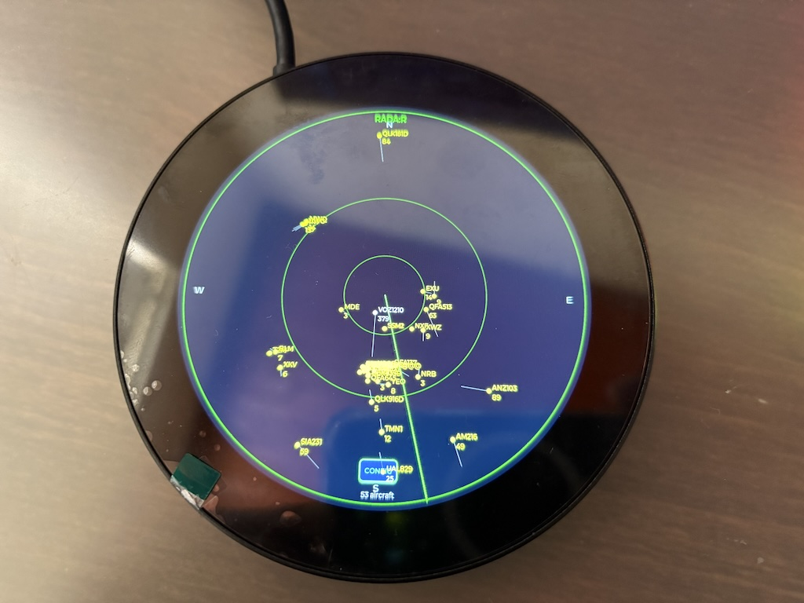

# ESP32-P4 ADSB Radar Display

A classic air traffic control radar display showing live aircraft within 50nm of Sydney, Australia.



 

## Features

- 🎯 Live ADSB aircraft tracking from [adsb.lol](https://adsb.lol)
- 🎨 Color-coded aircraft by altitude (yellow/orange/white)
- 🔄 Smooth configurable rotating sweep animation (default 10s)
- 📏 Distance rings at 10nm, 25nm, 50nm
- 🧭 Cardinal direction markers
- ✈️ Displays up to 64 aircraft simultaneously
- 📊 Real-time aircraft count display
- 💾 **NVS persistent configuration** - Settings stored in flash memory, retained across reboots

## Hardware

- **Display**: Waveshare ESP32-P4 800x800 Round LCD
- **Controller**: ESP32-P4 with SPIRAM
- **WiFi**: ESP32-C6 coprocessor (ESP-Hosted)
- **Graphics**: LVGL v9.2.0

## Quick Start

### Prerequisites

- ESP-IDF v5.5.1 installed
- Waveshare ESP32-P4 WiFi6 Touch LCD board
- WiFi network access

### Build & Flash

```bash
# Clone repository
git clone <your-repo-url>
cd radar_display

# Configure WiFi credentials
cp main/radar_config.h.example main/radar_config.h
# Edit main/radar_config.h and set:
#   WIFI_SSID and WIFI_PASSWORD
#   HOME_LAT and HOME_LON (optional - defaults to Sydney)

# Activate ESP-IDF
source /path/to/esp-idf/export.sh

# Build and flash
idf.py build flash monitor
```

### Configuration

**NVS Persistent Configuration**

The radar display uses NVS (Non-Volatile Storage) to persist configuration settings across reboots. On first boot, default values from `main/radar_config.h` are written to NVS.

**Setting Initial Configuration:**

Edit `main/radar_config.h` before building:

```c
// Home position (default: Sydney, Australia)
#define HOME_LAT -33.8127201f
#define HOME_LON 151.2059618f

// Radar radius in nautical miles
#define RADAR_RADIUS_NM 50

// WiFi credentials
#define WIFI_SSID "your-network"
#define WIFI_PASSWORD "your-password"
```

These values are automatically saved to NVS on first boot and will persist across power cycles.

**Runtime Configuration (Future):**

A settings menu will allow changing WiFi credentials, home location, radar radius, and display labels without reflashing. For now, to change settings after initial configuration, you can either:
- Flash with `idf.py erase-flash` to trigger a fresh first boot
- Modify the code to call `nvsconfig_write_config()` with new values

## How It Works

1. **ADSB Data**: Fetches aircraft data from `https://api.adsb.lol` every 10 seconds
2. **Coordinate Conversion**: Calculates distance (Haversine) and bearing from home position
3. **Screen Mapping**: Converts polar coordinates (distance, bearing) to screen pixels
4. **Rendering**: LVGL creates color-coded blips at aircraft positions
5. **Animation**: 60 FPS sweep rotation for smooth radar effect

## Display Guide

**Aircraft Colors:**
- **Yellow** - Low altitude (< 10,000 ft)
- **Orange** - Medium altitude (10,000 - 25,000 ft)
- **White** - High altitude (> 25,000 ft)

**Labels** (shown when < 20 aircraft):
- Callsign above aircraft
- Altitude in hundreds of feet below aircraft (e.g., "350" = 35,000 ft)

## Project Structure

```
radar_display/
├── main/
│   ├── main.c              # Application entry point
│   ├── radar_config.h      # Configuration structure + defaults
│   ├── nvsconfig.c/h       # NVS persistent storage
│   ├── wifi.c/h            # WiFi + NTP
│   ├── adsb_client.c/h     # ADSB API client
│   ├── aircraft_store.c/h  # Aircraft tracking + coordinates
│   └── radar_renderer.c/h  # Radar visualization (LVGL)
├── components/
│   └── bsp_extra/          # Board support extensions
├── CMakeLists.txt
├── sdkconfig.defaults
└── partitions.csv
```

## Future Improvements

See [PROJECT.md](PROJECT.md) for detailed improvement roadmap including:

- Touch interface for aircraft selection
- Settings screen (brightness, radius, color schemes)
- Flight track history
- Multiple data sources (dump1090, OpenSky)
- Audio alerts
- GPS integration for portable operation
- Data logging to SD card

## Performance

- **Memory**: 195KB internal RAM, 28MB SPIRAM free
- **Frame Rate**: 60 FPS sweep animation
- **Update Rate**: 10-second ADSB polling
- **Capacity**: Up to 64 aircraft tracked simultaneously

## Attribution

- **ADSB Data**: [adsb.lol](https://adsb.lol) - Free community ADS-B network
- **Graphics**: [LVGL v9.2.0](https://lvgl.io)
- **Hardware**: Waveshare ESP32-P4 800x800 Round LCD
- **Framework**: ESP-IDF v5.5.1

## License

MIT License - Free to use and modify

## Support

Check the serial monitor for debug output:
```bash
idf.py monitor
```

Look for:
- NVS configuration loading messages
- WiFi connection status
- ADSB API polling messages
- Aircraft count updates
- Heap memory statistics
